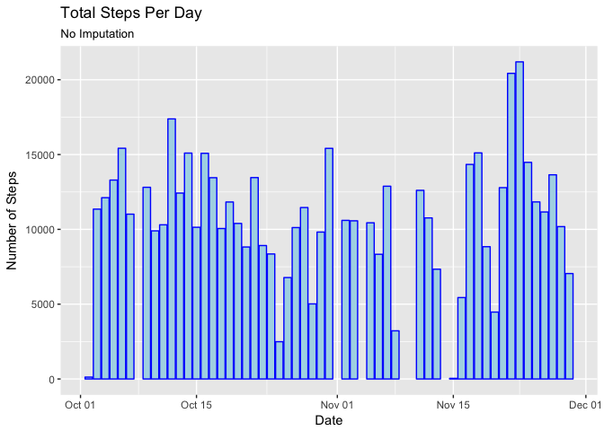
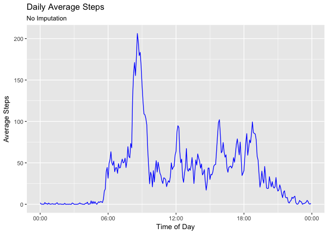
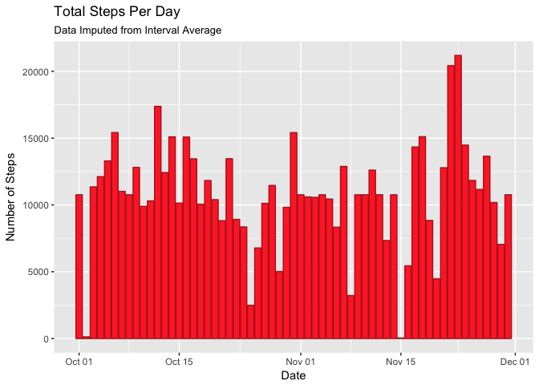

# Reproducible Research: Peer Assessment 1


```r
knitr::opts_chunk$set(echo = TRUE)
library(ggplot2)
library(scales)
Sys.setenv(TZ='UTC')
```

## Loading and preprocessing the data

The step data is loaded from a '[activity.csv](https://d396qusza40orc.cloudfront.net/repdata%2Fdata%2Factivity.zip)' file provided by the instructor. The variables included in this dataset are:

* **steps**: Number of steps taking in a 5-minute interval (missing values are coded as NA)
* **date**: The date on which the measurement was taken in YYYY-MM-DD format
* **interval**: Identifier for the 5-minute interval in which measurement was taken

A fourth column was appended using the code below to represent a POSIXct datetiem value, where the date and five-minute time of day are pasted together and parsed using the `strptime()` function.


```r
activityData <- read.csv(
    file = 'activity.csv',
    colClasses = c('integer', 'character','character'),
    header = TRUE,
    na.strings = c('NA')
)

## convert the date string to a POSIX value
activityData$date <- as.POSIXct(
    strptime(activityData$date, "%Y-%m-%d"),
    tz="UTC"
)

## convert the interval string to a POSIX value
activityData$interval <- as.POSIXct(
    strptime(
        paste(
                as.Date(as.POSIXct(0,
                                   origin = "1970-01-01",
                                   tz = "UTC")),
                " ",
                substr(sprintf("%04s", activityData$interval), 1, 2),
                ":",
                substr(sprintf("%04s", activityData$interval), 3, 4),
                ":00",
                sep = ""
        ),
        "%Y-%m-%d %H:%M:%S"
    ),
    tz = "UTC"
)

## combine the date and time into a single value
activityData$dateTime <- as.POSIXct(
    strptime(
        paste(  activityData$date,
                strftime(activityData$interval, format = "%H:%M:%S", tz = "UTC"),
                sep = " "
        ),
        "%Y-%m-%d %H:%M:%S"
    ),
    tz = "UTC"
)
```


## What is mean total number of steps taken per day?


```r
totalSteps <- aggregate(
    formula = steps ~ date,
    data = activityData,
    FUN = sum,
    na.action = na.omit
)


dailyStepsAvg <- mean(totalSteps$steps)
dailyStepsMedian <- median(totalSteps$steps)
```

```r
plotTotalSteps <- ggplot(totalSteps, aes(date))
plotTotalSteps + geom_bar(
    aes(weight = steps),
    color = "blue",
    fill = "lightblue"
    ) +
    labs(title = "Total Steps Per Day",
        subtitle = "No Imputation",
        x = "Date",
        y = "Number of Steps"
    )
```

<!-- -->
The average number of steps per day is **10766.2**.

The median number of steps per day is **10765**.


## What is the average daily activity pattern?

I guess I need to make a time-series plot of the inter-average for multiple days here.


```r
# create interval averages for all days
intervalStepsAvg <- aggregate(
    formula = steps ~ interval,
    data = activityData,
    FUN = mean,
    na.action = na.omit
)

# determine which interval has the largest number of steps
intervalStepsMax <- intervalStepsAvg[which.max(intervalStepsAvg$steps),]
```

```r
# plot 'em intervals up real good
plotIntervalSteps <- ggplot(intervalStepsAvg, aes(interval, steps))
plotIntervalSteps +
    geom_path(color = "blue") +
    labs(title = "Daily Average Steps",
         subtitle = "No Imputation",
         x = "Time of Day",
         y = "Average Steps") +
    scale_x_datetime(labels = date_format("%H:%M", tz = "UTC"))
```

<!-- -->

The 5-minute interval containing the most steps is **8:35 AM** with **206** steps.

## Imputing missing values

What I want to do here is append an additional column to the data frame, where the original `steps` values is used if not `NA`, and if the value is missing, substitute the average five-minute value for the entire data set that is appropriate for that specific interval.

The total number of `NA` intervals is **2304**.


```r
# append an imputed number of steps to the original activity data.
activityData$stepsImpute <- cbind(
    apply(activityData[,c("steps","interval")],
        1,
        function(x) as.integer(
            ifelse(
                is.na(x['steps']),
                    round(
                        intervalStepsAvg[
                            which(intervalStepsAvg$interval == x['interval']),
                        ]$steps,
                        digits = 0),
                x['steps']
            )
        )
    )
)
```

```r
# aggregate the imputed total steps.
totalStepsImpute <- aggregate(
    formula = stepsImpute ~ date,
    data = activityData,
    FUN = sum
)

names(totalStepsImpute) <- c("date","stepsImpute")

dailyStepsImputeAvg <- mean(totalStepsImpute$stepsImpute)
dailyStepsImputeMedian <- median(totalStepsImpute$stepsImpute)
```

```r
# make a graph, recieve cookie
plotTotalStepsImpute <- ggplot(totalStepsImpute, aes(date))
plotTotalStepsImpute + geom_bar(
    aes(weight = stepsImpute),
    color = "firebrick",
    fill = "firebrick1"
    ) +
    labs(title = "Total Steps Per Day",
        subtitle = "Data Imputed from Interval Average",
        x = "Date",
        y = "Number of Steps"
    )
```

<!-- -->

After imputation, the average number of steps per day is **10765.6**.

The median number of steps per day is **10762**.

## Are there differences in activity patterns between weekdays and weekends?

Yes, I am wasting my stupid weekend working on this project, while instead, I get paid to work on weekdays.


```r
#add a day of week, why not?
activityData$dayOfWeek <- cbind(weekdays(activityData$dateTime))

#then classify that day from above as a weekday/weekend in another column
activityData$weekend <- cbind(
    apply(
        activityData[,"dayOfWeek"],
        1,
        function(x) ifelse(x %in% c("Saturday","Sunday"), "Weekend", "Weekday")
    )
)

# calculate interval averages of imputed steps for weekdays, yay!
intervalStepsAvgWeekday <- aggregate(
    formula = stepsImpute ~ interval,
    data = activityData[which(activityData$weekend == "Weekday"),],
    FUN = mean,
    na.action = na.omit
)

names(intervalStepsAvgWeekday) <- c("interval","stepsImpute")

# I should probably have defined a function to aggregate this!
intervalStepsAvgWeekend <- aggregate(
    formula = stepsImpute ~ interval,
    data = activityData[which(activityData$weekend == "Weekend"),],
    FUN = mean,
    na.action = na.omit
)

names(intervalStepsAvgWeekend) <- c("interval","stepsImpute")
```


```r
# make another graph, probably should have written a function for this, too!
plotIntervalStepsWeekday <- ggplot(intervalStepsAvgWeekday, aes(interval, stepsImpute))
plotAvgWeekday <- plotIntervalStepsWeekday +
    geom_path(color = "blue") +
    labs(title = "Daily Average Steps",
         subtitle = "Weekday",
         x = "Time of Day",
         y = "Average Steps") +
    scale_x_datetime(labels = date_format("%H:%M", tz = "UTC")) +
    ylim(0, 250)

# yeah, I definitely should have written a function to do this!
plotIntervalStepsWeekend <- ggplot(intervalStepsAvgWeekend, aes(interval, stepsImpute))
plotAvgWeekend <- plotIntervalStepsWeekend +
    geom_path(color = "blue") +
    labs(title = "Daily Average Steps",
         subtitle = "Weekend",
         x = "Time of Day",
         y = "Average Steps") +
    scale_x_datetime(labels = date_format("%H:%M", tz = "UTC")) +
    ylim(0, 250)

multiplot(plotAvgWeekday, plotAvgWeekend, cols = 1)
```

<!-- -->

Yeah, there sure are some differences there.
